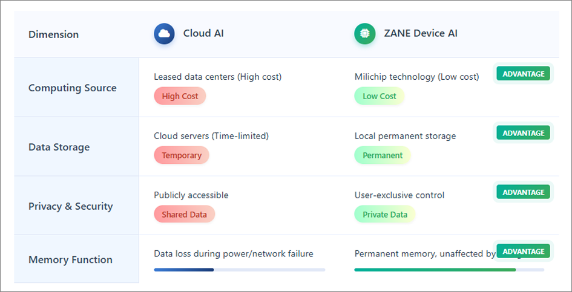
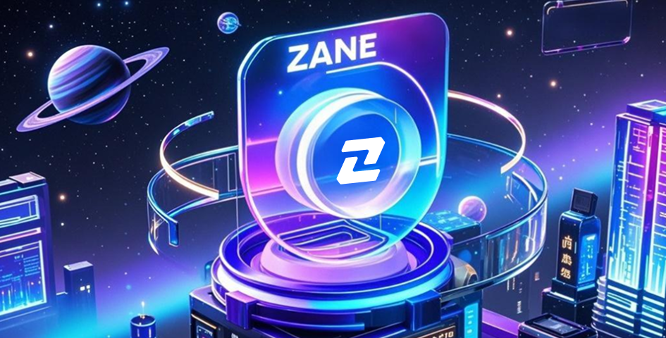
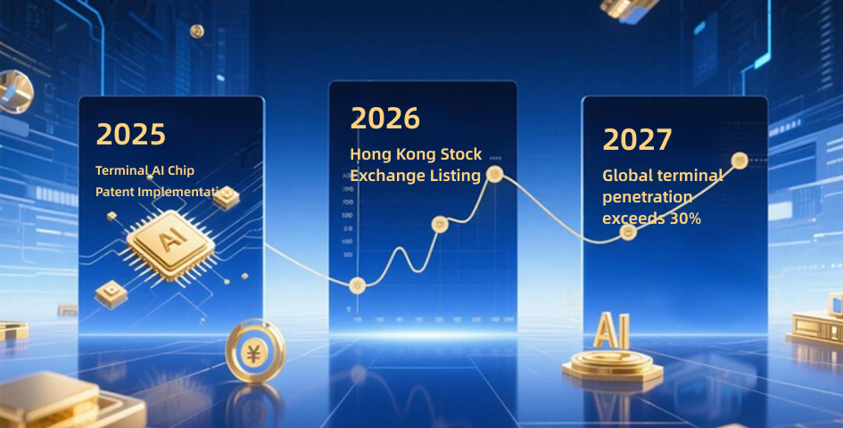

# ZANE Reshapes the Future of AI  
## The World's First Companion AI Technology  
### Creating an Eternal Memory Ecosystem and Unlocking a Trillion-Dollar Market

---

In the wave of the global AI explosion, ZANE takes the lead in innovating companion AI technology. On **July 13, 2025**, ZANE was successfully developed and patented. As one of fewer than 10 global companies working on terminal AI, it pioneers the future of intelligent memory.

By combining AI chips, multimodal large models, and a full-stack system, ZANE builds the foundation for truly **emotional, memory-based, and autonomous AI** — setting the stage for a trillion-dollar market.

---

## 1. Memory + Emotion + Autonomy: The Birth of Companion AI

ZANE integrates:
- Proprietary AI chips
- Multimodal large language models (LLMs)
- On-device long-term memory modules

Which enables:
- Emotional interaction
- Offline operation
- Local storage (privacy-safe)
- Behavioral learning & evolution
- Lifelong companionship

ZANE marks the beginning of a **new species of AI**: one that can grow with you.

---

## 2. AI's New Use Cases

ZANE opens up broad, real-world applications, including:
- AI Companions  
- AI Doctors  
- AI Pets  
- AI Education  
- AI Secretaries  
- AI Smart Home Devices  
- AI Financial Advisors  
- AI Toys

It creates the **universal intelligence interface** for the next generation of terminals.

---

## 3. RWA-Driven Digital Economy Ecosystem

ZANE is building a triple-layered **RWA (Real World Asset)** system:
1. **Data On-chain**: Stores user behavior, memory, interaction history  
2. **Value On-chain**: Token economic system with staking, rewards, etc.  
3. **Asset On-chain**: Anchored by 3,500+ global physical retail stores  

Strategic ecosystem:
- 5 wholly-owned subsidiaries  
- 3 ecosystem companies  
- 1 Hong Kong corporate entity  
- 36% equity transferred to “All Things Linked AI Tech (HK)”
- **IPO expected in 2026 (HK Main Board)**

---

## 4. $ZANE Token Model

- **Total Supply**: 1,000,000,000  
- **Buyback & Burn**: 50% of platform net revenue  
- **Staking Yield**: 22% APY (for 365+ day holders)

Redemption Scenarios:
1. Physical store redemption  
2. CEX/DEX trading  
3. Rights redemption (NFTs, licenses)  
4. Website redemption  
5. Ecosystem partner usage  
6. AI service activation

ZANE creates a **real-use token with multi-dimensional value**.

---

## 5. 7-Year Blueprint: From Chip to Global AI Domination

- **2018–2020**: Technical incubation  
- **2021–2024**: Full-stack system R&D, talent gathering  
- **2025**: ZANE officially launched  
- **2026**: Hong Kong IPO  
- **2027**: Global scale-up, mass commercial deployment

---

## 6. Call for Global Developers, Partners & Investors

ZANE invites partners from around the world to join its AI ecosystem.  
We aim to build the future of intelligent companionship and create the most trusted, emotional, and memory-powered AI companion in history.

---